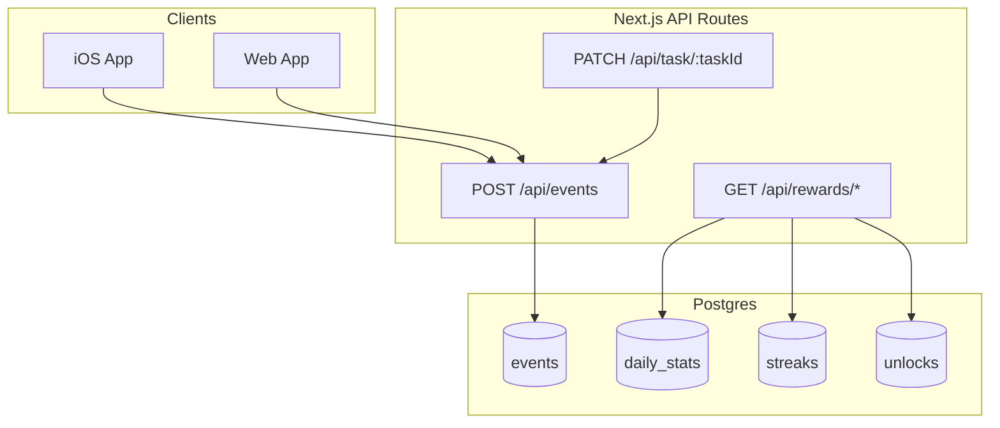

# Rewards & Reinforcement System — What’s Implemented

This document describes the **current implementation** of the rewards/reinforcement system in Stickies AI: the logic, the code structure, and how to run/test it.

Accuracy-based rewards are **intentionally deferred** for now.

---

## Goals (implemented so far)

- **Event-driven behavior layer**: log user actions as append-only events.
- **Progress visualization data**: compute daily totals + an effort score for heatmaps and reports.
- **Streak tracking**: minimal streak engine (no grace-days yet).
- **Milestones + unlocks**: first milestone (7-day streak) awards a theme unlock.
- **Surfaces**
  - **Web debug UI**: `/rewards` page (not linked in main nav).
  - **iOS UI**: new `Rewards` tab with heatmap + recap + highlights + unlocks.

---

## Architecture (data flow)



---

## Database schema (tables added)

Defined in [`packages/web/src/lib/db/schema.ts`](../packages/web/src/lib/db/schema.ts) and created via `initializeDatabase()` in [`packages/web/src/lib/db/client.ts`](../packages/web/src/lib/db/client.ts).

- **`public.user_preferences`**
  - `user_id` (PK), `reward_style`, `timezone`, `created_at`, `updated_at`
  - Note: table exists; preferences are not yet actively used in UI copy.

- **`public.events`**
  - Append-only event log: `user_id`, `event_type`, `occurred_at`, `metadata` (JSONB)

- **`public.daily_stats`**
  - Aggregated per day: `user_id`, `date`, `effort_score`, `tasks_completed`, `reviews_completed`, `streak_maintained`

- **`public.streaks`**
  - `user_id`, `current_streak`, `longest_streak`, `last_active_date` (DATE), timestamps
  - Current engine: **no grace-days yet**.

- **`public.unlocks`**
  - `user_id`, `unlock_type`, `is_enabled`, `earned_at`, `metadata`
  - Enforced uniqueness: `UNIQUE(user_id, unlock_type)` to keep awards idempotent.

---

## Events (what’s logged)

### `task_completed`

- Emitted when a task is marked completed through the web API.
- Instrumented in [`packages/web/src/app/api/task/[taskId]/route.ts`](../packages/web/src/app/api/task/[taskId]/route.ts) (non-blocking; failures do not break task completion).

### `sticky_reviewed`

- Emitted when a user marks a learning sticky as **Learned** or **Needs review** on iOS.
- Wired in [`packages/ios/app/(tabs)/learning-stickies.tsx`](../packages/ios/app/(tabs)/learning-stickies.tsx) via `trackStickyReview(...)` in the iOS API client.

---

## Effort score (heatmap intensity)

Implemented in [`packages/web/src/lib/db/daily-stats.ts`](../packages/web/src/lib/db/daily-stats.ts).

We compute an effort score per day:

\[
S(d) = 0.4 \cdot \min(T_{\text{tasks}}, 5) + 0.4 \cdot \min(T_{\text{reviews}}, 20) + 0.2 \cdot I_{\text{streak}}
\]

- `T_tasks`: count of `task_completed` events that day (cap 5)
- `T_reviews`: count of `sticky_reviewed` events that day (cap 20)
- `I_streak`: currently passed as `false` in the heatmap path (streak integration can be tightened later)

Aggregation:
- `aggregateDailyStatsForUserOnDate(userId, date, { streakMaintained })` reads events for that user/day and upserts `daily_stats`.
- `getDailyStatsForUserInRange(userId, from, to)` fetches stats for UI/reporting.

---

## Streak logic (current)

Implemented in [`packages/web/src/lib/db/streaks.ts`](../packages/web/src/lib/db/streaks.ts).

Current behavior:
- First active day: `current_streak = 1`
- If the user is active on the **next consecutive day**: `current_streak += 1`
- If there’s a gap of 2+ days: streak resets to `1` on the next active day
- If `hasActivity=false`: no DB update; the next active day determines whether it increments or resets.

Important implementation note:
- `streaks.last_active_date` is a **Postgres DATE**.
- We write it as `YYYY-MM-DD` string to avoid timezone drift.

---

## Milestones + unlocks (current)

### Unlock storage

Implemented in [`packages/web/src/lib/db/unlocks.ts`](../packages/web/src/lib/db/unlocks.ts):

- `ensureUnlock(userId, unlockType, metadata?)` is **idempotent** (uses `ON CONFLICT`).
- `getUserUnlocks(userId)` returns all unlocks.

### First milestone: 7-day streak → theme unlock

Implemented in [`packages/web/src/lib/db/milestones.ts`](../packages/web/src/lib/db/milestones.ts):

- When `streak.current_streak >= 7`, award unlock:
  - `unlock_type = 'theme'`
  - metadata includes `{ milestone: 'seven_day_streak', currentStreak: ... }`

This is called from the streak update path inside `updateStreakForDate(...)`.

---

## API routes (rewards)

### `POST /api/events`

- File: [`packages/web/src/app/api/events/route.ts`](../packages/web/src/app/api/events/route.ts)
- Accepts `{ event_type, metadata }` and inserts into `events`.
- Special validation for `sticky_reviewed` payload.

### `GET /api/rewards/daily-stats`

- File: [`packages/web/src/app/api/rewards/daily-stats/route.ts`](../packages/web/src/app/api/rewards/daily-stats/route.ts)
- Returns the last N days (default 30).

### `GET /api/rewards/weekly-report`

- File: [`packages/web/src/app/api/rewards/weekly-report/route.ts`](../packages/web/src/app/api/rewards/weekly-report/route.ts)
- Uses the weekly aggregation helper:
  - [`packages/web/src/lib/db/rewards-report.ts`](../packages/web/src/lib/db/rewards-report.ts)

### `GET /api/rewards/highlights`

- File: [`packages/web/src/app/api/rewards/highlights/route.ts`](../packages/web/src/app/api/rewards/highlights/route.ts)
- Returns a small, derived highlight set (best day + consistency summary).

### `GET /api/rewards/unlocks`

- File: [`packages/web/src/app/api/rewards/unlocks/route.ts`](../packages/web/src/app/api/rewards/unlocks/route.ts)
- Returns current unlocks for the user.

---

## Web UI (debug surface)

- Path: `http://localhost:3000/rewards`
- File: [`packages/web/src/app/rewards/page.tsx`](../packages/web/src/app/rewards/page.tsx)

Implementation detail:
- This is a **Server Component** and **does not** call `fetch('/api/...')` (Node can’t resolve relative URLs).
- It calls DB helpers directly (Option A) and renders:
  - Heatmap (30 days)
  - Weekly recap
  - Highlights

Note: It is **not linked** from the main page tabs; it’s a direct route.

---

## iOS UI (main surface)

### Rewards tab

- New tab entry in [`packages/ios/app/(tabs)/_layout.tsx`](../packages/ios/app/(tabs)/_layout.tsx)
- Screen: [`packages/ios/app/(tabs)/rewards.tsx`](../packages/ios/app/(tabs)/rewards.tsx)

The screen loads:
- daily stats (`/api/rewards/daily-stats`)
- weekly report (`/api/rewards/weekly-report`)
- highlights (`/api/rewards/highlights`)
- unlocks (`/api/rewards/unlocks`)

### Sticky reviews emit events

In [`packages/ios/app/(tabs)/learning-stickies.tsx`](../packages/ios/app/(tabs)/learning-stickies.tsx):
- Status changes are persisted to AsyncStorage under:
  - `learningStickyProgress:${userId}`
- Also emits `sticky_reviewed`:
  - via `trackStickyReview(...)` in [`packages/ios/src/api/client.ts`](../packages/ios/src/api/client.ts)

---

## Testing strategy (what to run now)

### Web package unit tests (Vitest)

From `packages/web`:

```bash
cd packages/web

# Core DB/rewards tests
npm test -- \
  src/tests/lib/db/daily-stats.test.ts \
  src/tests/lib/db/streaks.test.ts \
  src/tests/lib/db/unlocks.test.ts \
  src/tests/lib/db/milestones.test.ts
```

These tests cover:
- effort score caps + aggregation behavior
- streak increment/reset logic
- unlock idempotence
- 7-day streak milestone awarding `theme` unlock

### Web app manual run

```bash
cd packages/web
npm run dev
```

Then visit:
- `http://localhost:3000/rewards`

### iOS app manual run

Run the iOS app as usual (Expo). Then:
- Go to **Learning** → mark cards **Learned** / **Needs review** (this emits `sticky_reviewed`)
- Go to **Tasks** → complete some tasks (emits `task_completed` if completed via web API; iOS task completion currently uses `updateTask` and should also be validated depending on backend route used)
- Go to **Rewards** tab → pull to refresh

---

## Known limitations / next improvements

- **Grace-days**: not implemented (current streak breaks after missed days).
- **Streak integration into daily_stats**: heatmap currently passes `streakMaintained=false` in the “compute on read” path.
- **More milestones**: comeback, volume (e.g., 500 reviews), mastery-by-domain require more event/state modeling.
- **iOS automated tests**: no Jest/RTL harness currently present in `packages/ios`.

